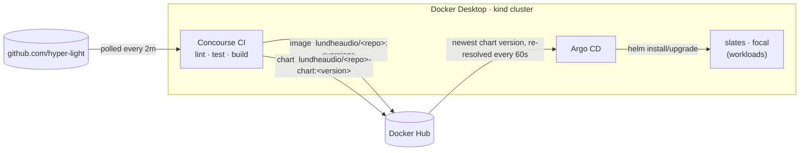

# localkind

Setup and config for local Kind development: a complete CI/CD platform for the
[hyper-light](https://github.com/hyper-light) repos, running in the Kubernetes cluster that Docker
Desktop provisions with kind.



**Concourse** runs CI for every repo and pushes two artifacts for each deployable one — a container
image and a Helm chart pinned to that exact image. **Docker Hub** is the hand-off point.
**Argo CD** watches for new chart versions and deploys them. CI never talks to Argo CD and needs no
write access to any Git repo.

| | URL | Login |
|---|---|---|
| Concourse | <http://localhost:8080> | `admin` / generated |
| Argo CD | <http://localhost:8081> | `admin` / generated |

Passwords are generated at install time. `make secrets` writes them to `.secrets/credentials.env`
(git-ignored, mode 0600); `make access` prints them.

---

## Quick start

### Prerequisites

1. **Docker Desktop** with Kubernetes enabled: *Settings → Kubernetes → Enable Kubernetes*, cluster
   type **kind**. Any node count works; slates needs at least 3 worker nodes (it uses required pod
   anti-affinity). Check with `docker desktop kubernetes status`.
2. `kubectl`, `helm`, `jq`, `git`, `curl` on your `PATH` (`brew install kubectl helm jq`).
   The `fly` and `argocd` CLIs are installed for you, version-matched to the servers.
3. A **Docker Hub personal access token with Read & Write scope**
   (hub.docker.com → *Account settings → Personal access tokens*), exported from `~/.zshrc`:
   ```sh
   export DOCKER_PAT="dckr_pat_..."
   ```
   The token must belong to the account named by `DOCKER_USER` in [`env.sh`](env.sh) (default
   `lundheaudio`) — that one setting is both the login and the namespace artifacts are pushed to.
   A valid token with the wrong username fails exactly like a bad token (HTTP 401).

### Bootstrap

```sh
make bootstrap
```

That one command takes an empty cluster to a working platform, and is safe to re-run at any time:

| Step | Script | What it does |
|---|---|---|
| Preflight | `00-preflight.sh` | Tools, cluster health, default StorageClass, free ports, token present |
| Concourse secrets | `10-concourse-secrets.sh` | Generates signing/SSH keys + admin and DB passwords straight into Kubernetes Secrets |
| Concourse | `20-concourse.sh` | Helm install of web + 2 workers + Postgres; waits for the API |
| Argo CD | `30-argocd.sh` | Helm install; applies `argocd/projects` and `argocd/apps` |
| Docker Hub credentials | `40-registry-credentials.sh` | Verifies the token with Docker Hub (incl. push scope), then installs it for pipelines and Argo CD |
| CLIs | `50-cli-login.sh` | Installs `fly` + `argocd` to `~/.local/bin` and logs both in |
| Local credentials | `60-local-secrets.sh` | Writes `.secrets/credentials.env` |
| Warm image cache | `65-warm-images.sh` | Pulls every pipeline base image into Concourse's cache **one at a time** (see *Concourse on kind*) |
| Pipelines | `70-pipelines.sh` | Sets and unpauses every pipeline in `pipelines/` |

If the Docker Hub token is rejected, bootstrap still brings everything up (CI runs; only pushes
fail) and exits non-zero telling you so. Fix the token, then `make credentials`.

### Then, once per app

Two charts need something only a human-in-the-loop step can provide. Both are one command:

| App | Why | Command |
|---|---|---|
| **focal** | Host pods mount a Secret of single-use invitations that only the *running* founder can mint; they wait in `ContainerCreating` until it exists. | `make focal-invitations` (after Argo CD's first sync) |
| **slates** | The chart requires a TLS identity per pod and deliberately never generates one; until then the app shows `ComparisonError`. Afterwards consensus must be initialised once. | `make slates-identities` (needs a slates checkout + `cargo`), then the `bootstrap root` command it prints |

---

## Everyday use

```sh
make status        # pods, workers, pipelines, latest build per job, Argo CD apps
make access        # URLs + credentials        (make open: open both UIs)
make login         # re-login when fly says "not authorized" (tokens last 24h)
make check         # validate pipelines + scripts and scan for secrets — run before committing
```

```sh
fly -t hl pipelines
fly -t hl trigger-job -j slates/publish --watch     # run a job now and stream its log
fly -t hl watch -j focal/test                       # follow the latest build
fly -t hl hijack -j slates/test                     # shell into a (failed) build's container
fly -t hl check-resource -r slates/repo             # poll GitHub now instead of waiting 2m
argocd app list
argocd app get slates
argocd app sync focal                               # sync now instead of waiting ≤60s
```

### Change a pipeline

Pipelines are GitOps'd. The **`localkind` meta-pipeline** watches `pipelines/` on `main` of this
repo and re-applies every pipeline on each push — so edit, `make check`, commit, push, done.
To try something before pushing: `scripts/70-pipelines.sh slates` applies your working tree (the
next push to `pipelines/` overwrites it). Shared tasks under `ci/` are fetched from `main` at build
time, so they too take effect on push.

### Add a repo

1. Copy the closest pipeline to `pipelines/<repo>.yml` — `vorpal.yml` (Rust, CI only),
   `mkfst-py.yml` (Python), `sylk.yml` (Go), `hyperlight-site.yml` (Node), or `slates.yml` (CI +
   image + chart).
2. Add a `set_pipeline` step for it in `pipelines/localkind.yml`.
3. Deployable? Copy `argocd/apps/focal.yaml` to `argocd/apps/<repo>.yaml`, change the names, and
   run `make argocd`.
4. `make check`, commit, push. (First time only: `scripts/70-pipelines.sh <repo>`.)

### Rotate the Docker Hub token

Replace `DOCKER_PAT` in `~/.zshrc`, then `make credentials`. It re-verifies before replacing anything.

### Reset the cluster

```sh
docker desktop kubernetes reset-cluster   # wipes everything in the cluster
make bootstrap                            # rebuilds it; new passwords land in .secrets/
```

Nothing of value lives only in the cluster: config is in this repo, artifacts are on Docker Hub.
Build history and caches are lost. focal/slates need their one-time steps again.

### Upgrade Concourse or Argo CD

Bump the chart/app versions in [`env.sh`](env.sh) (and `imageTag` in `concourse/values.yaml`), then
`make concourse` or `make argocd`, then `make login` to pick up matching CLIs.

---

## How it works

### Layout

```
env.sh                    every tunable: context, ports, versions, Docker Hub user
Makefile                  discoverable entry points (make help)
scripts/                  numbered bootstrap steps + access/status/check
  apps/                   one-time per-app helpers (focal invitations, slates identities)
concourse/values.yaml     Helm values for Concourse
argocd/values.yaml        Helm values for Argo CD
argocd/projects/          AppProject: what may be deployed, and where
argocd/apps/              one Application per deployable repo
pipelines/                one Concourse pipeline per repo + the localkind meta-pipeline
ci/tasks, ci/scripts      shared build steps: version, build-image, publish-chart
.secrets/                 generated, git-ignored — local copy of the UI credentials
```

### Pipelines

Every pipeline polls its repo every 2 minutes (a laptop behind NAT cannot receive GitHub webhooks).
Each mirrors what the repo's GitHub Actions already check on Linux; the workflows themselves are
untouched. `Status` is what each job did on its first run here / what upstream CI shows — a red job
below is the repo's state, not a platform problem.

| Pipeline | Jobs | Publishes | Notes |
|---|---|---|---|
| `slates` | `lint` `test` → `publish` | image + chart | Gate is **open** (`passed: []`): `main` is red upstream from timing-sensitive tests, so a strict gate would never deploy. Flip to `[lint, test]` in `pipelines/slates.yml` when green. |
| `focal` | `lint` `test` → `publish` | image + chart | Tracks branch **`r10-r11-windows-ci`** — the Dockerfile and chart exist only there, and `main` cannot pass CI from a clean clone. Strict gate. Tests take ~30 min. |
| `hyperscale` | `test` `package` → `publish` | image only | Chart is still the `helm create` nginx scaffold and the image has no long-running entrypoint, so there is nothing meaningful to deploy yet. Details in the pipeline file. |
| `vorpal` | `lint` `test` | — | Heaviest build (581 crates, 48 tree-sitter grammars). |
| `mkfst-py` | `lint` `test` → `build` | — | |
| `cocoa` | `lint` `package` | — | No test suite exists upstream. |
| `sylk` | `vet` `test` | — | Shallow clone (repo is ~500 MB). |
| `hyperlight-site` | `lint` `test` `build` | — | Deployment stays with the Vercel integration. |
| `localkind` | `reconfigure` | — | Keeps all of the above in sync with this repo. |

Deliberately not ported: macOS/Windows jobs, anything needing a Docker daemon or its own kind
cluster (slates' `kind` lane), root NFS mounts (slates `conformance`), x86-only benchmarks (vorpal
`encoder-x86`), Playwright e2e, and every **release** workflow — PyPI/npm trusted publishing is
bound to GitHub's OIDC identity, and GitHub Releases need a write token. Those stay on Actions.

### Versioning

One version per build, shared by the image tag, the chart version and the chart's `appVersion`:

```
<base version from Cargo.toml | pyproject.toml>-ci.<git commit count>        0.1.0-ci.718
```

The commit count is monotonic on a branch, and SemVer compares numeric pre-release identifiers
numerically (`ci.9 < ci.10`), so version order equals commit order. Rebuilding a commit reproduces
its version, so re-runs are idempotent. Images also get `sha-<short sha>` and `latest`.

### Docker Hub layout

`helm push` names an OCI repository after the chart, which on Docker Hub would be the *same*
repository as the image, with colliding version tags. So CI publishes each chart as
`<name>-chart`, renaming only the packaged copy (never your `Chart.yaml`) and baking
`nameOverride` in so resource names and labels are unchanged:

```
docker pull lundheaudio/slates:0.1.0-ci.718
helm  pull oci://registry-1.docker.io/lundheaudio/slates-chart --version 0.1.0-ci.718
```

The chart is pushed *after* the image and its `values.yaml` is pinned to that image, so Argo CD can
never roll out a chart whose image does not exist.

### Argo CD

Each Application tracks `targetRevision: ">=0.0.0-0"` — the highest version including
pre-releases, i.e. always the newest CI build — with automated sync, prune and self-heal.
`timeout.reconciliation` is 60s, so a publish is live about a minute later. The `hyper-light`
AppProject only allows charts from our Docker Hub namespace, deployed into this cluster.

### Concourse on kind

- Workers are privileged pods running their own containerd; task containers are nested inside.
  Work dirs are local-path PVCs — plain ext4 on the node, so the overlay volume driver works.
- Task containers inherit the pod's resolver, so both public names and `*.svc.cluster.local` resolve.
- 2 workers, each capped at 8 CPU / 24 GiB — builds run inside the worker pod's cgroup, so that caps
  all CI on the worker. At most 3 tasks run per worker (`limitActiveTasks`); the rest queue.
  Within a Rust pipeline `serial_groups` runs one cargo job at a time.
- Build caches (`cargo-home`, `target`, uv/pip/npm/go caches, BuildKit layers) are Concourse task
  caches: per worker, per job. The first build of anything is cold.
- **Cold starts are serialised on purpose.** Unpausing a cold cluster starts ~18 jobs that each
  pull a 100-600 MB image at once, and Docker Desktop's network path does not survive that many
  parallel flows: pulls stall, then die with `TLS handshake timeout`, `unexpected EOF` or DNS
  errors. So bootstrap pre-pulls each base image sequentially (`make warm`) before unpausing.
  Concourse keys the cache by image source + digest — shared by every pipeline — and streams it
  worker-to-worker inside the cluster, so each image crosses the NAT once.
- For the same reason base images are pipeline *resources* fetched with `attempts: 3`, as are git
  clones and pushes. The tasks themselves have no `attempts`: a flaky download retries, a red test
  suite fails once. Python and Node use `-slim` images (~60 MB instead of ~400 MB).
- Images are built with `concourse/oci-build-task` (BuildKit) for **linux/arm64** on Apple Silicon.
  For multi-arch, see the comment in `ci/tasks/build-image.yml` — the foreign arch is emulated.
- The UIs are `LoadBalancer` Services. Docker Desktop's kind cloud-provider publishes those on
  `localhost`, so there is no ingress controller and no `kubectl port-forward` to keep alive.

### Secrets

**Nothing secret is in this repo, and nothing secret is ever passed on a command line** (with one
noted exception: `fly login` / `argocd login` only accept a password flag — that is the local
platform's own admin password, never the Docker Hub token).

| Secret | Lives in | Created by |
|---|---|---|
| Docker Hub token | `~/.zshrc` (yours) → `concourse-main/docker`, `argocd/repo-dockerhub-oci` | `40-registry-credentials.sh` |
| Concourse signing + SSH keys | `concourse/concourse-web`, `concourse/concourse-worker` | `10-concourse-secrets.sh`, via Concourse's own `generate-key` |
| Concourse admin login | `concourse/concourse-admin` (+ `local-users` in `concourse-web`) | `10-concourse-secrets.sh` |
| Concourse DB password | `concourse/concourse-db` | `10-concourse-secrets.sh` |
| Argo CD admin login | `argocd/argocd-initial-admin-secret` | Argo CD itself |
| slates pod identities | the live `slates` Application (`spec.source.helm.values`) | `apps/slates-identities.sh` |
| Local copy of the two UI logins | `.secrets/credentials.env`, git-ignored, 0600 | `60-local-secrets.sh` |

Pipelines reference `((docker.username))` / `((docker.password))`; Concourse's Kubernetes credential
manager resolves those at run time from Secret `docker` in namespace `concourse-main`, and redacts
them from build logs. Generated secrets are never regenerated on re-run (that would orphan workers
or lock Concourse out of its database).

`make check` scans everything git tracks or would track — for secret-shaped strings *and* for exact
matches of the real live values — and `60-local-secrets.sh` refuses to write unless git confirms
its target is ignored. To enforce it on every commit:

```sh
ln -s ../../scripts/check.sh .git/hooks/pre-commit
```

---

## Troubleshooting

**A UI will not load in the browser, but `curl` works.** Docker Desktop publishes these ports on
IPv4 loopback only. A browser that resolves `localhost` to `::1` first may stall;
`curl -4 http://localhost:8080/api/v1/info` proves the service is fine. Always use the URLs exactly as
shown — Concourse's login redirects to its configured external URL, so mixing `localhost` and
`127.0.0.1` breaks the login cookie.

**`Docker Hub rejected the credentials (HTTP 401)`.** Either `DOCKER_USER` in `env.sh` is not the
account that owns the token (check this first — Docker Hub gives the same 401 for a wrong username
as for a wrong token), or the token is revoked/expired: create a new **Read & Write** token and
update `~/.zshrc`. Then `make credentials`.

**`publish` fails at `put: image` or at `helm push` with unauthorized.** Same cause; check
`make status` → *Docker Hub credentials*.

**An Argo CD app shows `ComparisonError … unable to get tags`.** Nothing has been published for it
yet — it clears itself after the first green `publish`. For slates it can also mean identities are
missing: `make slates-identities`.

**Lots of builds `errored` at once with `Could not resolve host` / `no such host` / `i/o timeout`.**
The Mac went to sleep. Builds run in Docker Desktop's VM, which freezes with the machine; during
macOS dark wakes it runs for a few seconds *without* network, and whatever starts then fails on DNS.
Confirm with `pmset -g log | grep -E ' (Sleep|Wake|DarkWake) '` and compare to the build times. On
battery the default idle sleep is very short. Keep the machine awake while CI runs —
`caffeinate -i` in a spare terminal (closing the lid still sleeps it) — then re-trigger:
`fly -t hl trigger-job -j <pipeline>/<job>`. Nothing needs repairing afterwards.

**`failed to interpolate task config: undefined vars: …`** on a script you just edited. Concourse
reads `((name))` anywhere in a pipeline as a variable — including shell arithmetic like
`$((end-start))`; adding spaces does not help, any `((`…`))` pair is parsed. In inline scripts use
`expr` instead, or move the script to a file under `ci/scripts/`, which is not interpolated.
`make check` catches this.

**Builds `errored` with `TLS handshake timeout` / `unexpected EOF` / `image fetching failed` while
the machine was awake.** Too many large downloads at once (typically right after a cluster reset).
`make warm` pulls the base images one at a time, then re-trigger the jobs.

**Builds sit at "all workers are busy".** That is the task cap doing its job. Raise
`limitActiveTasks` or `worker.replicas` in `concourse/values.yaml`, then `make concourse`.

**`toomanyrequests` pulling a base image.** Docker Hub's anonymous pull limit. Add
`username: ((docker.username))` / `password: ((docker.password))` to that task's `image_resource.source`.

**A worker is `stalled` after the laptop slept, or a build hangs on a volume.**
`fly -t hl prune-worker -w <name>`, or `kubectl -n concourse delete pod <worker>`; it re-registers.

**`fly: not authorized`.** Tokens last 24 hours: `make login`.

**After a cluster reset the old passwords do not work.** They were regenerated:
`cat .secrets/credentials.env` (bootstrap refreshes it).

---

## License

[MIT](LICENSE)
